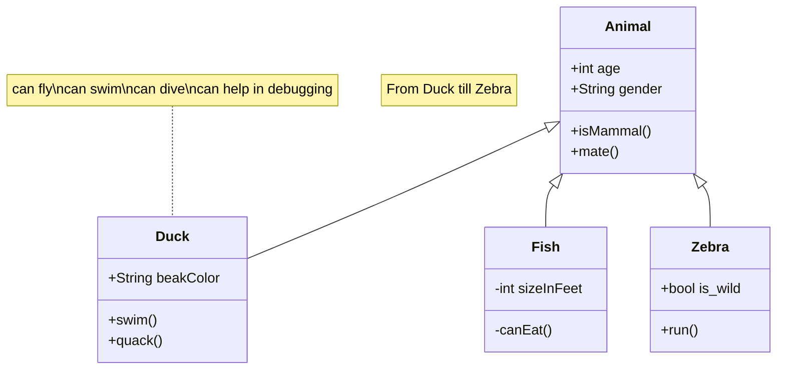

:::danger Not Yet Written!

TODO

:::

The Canary version of Docusarus added support for [Mermaid.js](https://mermaid.js.org/intro/), a tool that allow the graphics below to be made very easily.\
This page will use Mermaid heavily.

A simple [flow chart](https://mermaid.js.org/syntax/flowchart.html)

A [class diagram](https://mermaid.js.org/syntax/classDiagram.html)

